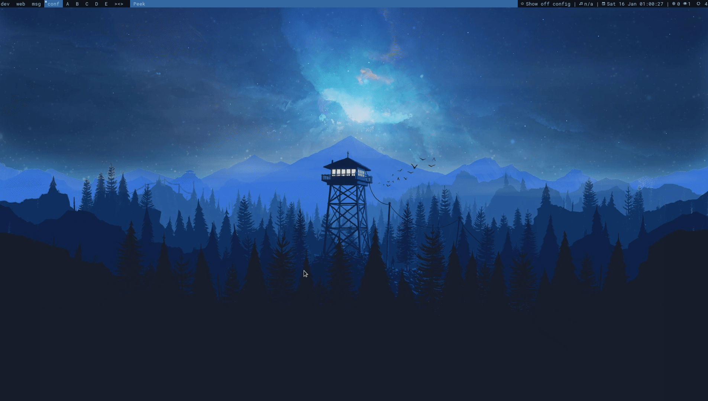

# .config

## Contents
- WM: [dwm](https://dwm.suckless.org/) - simple but extensible
- Shell: [zsh](https://ohmyz.sh/) - the good shell
- Terminal: [kitty](https://sw.kovidgoyal.net/kitty/) - actually usable (unlike `st`)
- Editor: [emacs](https://www.gnu.org/software/emacs/) - the one true editor
- Launcher: [dmenu](https://tools.suckless.org/dmenu/) - suckless spotlight with flexibility
- Status bar: [slstatus](https://tools.suckless.org/slstatus/) - a suckless bar
- Lock screen: [slock](https://tools.suckless.org/slock/) - hands off my machine
- PDF viewer: [zathura](https://pwmt.org/projects/zathura/) - the pretty pdf viewer
- Notifications: [dunst](https://github.com/dunst-project/dunst) - works with dbus which is a plus
- Keybinds: [xmodmap](https://wiki.archlinux.org/index.php/xmodmap), [xbindkeys](https://wiki.archlinux.org/index.php/Xbindkeys), [xcape](https://github.com/alols/xcape) - all the keybinds

## Keyboard Modification
Based off of [this blog post](https://stevelosh.com/blog/2012/10/a-modern-space-cadet). 

- Tap CapsLock -> Escape
- Hold CapsLock -> Control
- Tap Shift_L -> (
- Tap Shift_R -> )
- Control key -> Hyper

## Pywal

Custom pywal templates and a custom dwm patch allow for changing essentially everything's colors with pywal. [ewal](https://gitlab.com/jjzmajic/ewal) works great for Emacs.

## dwm and dmenu patches
For dwm: vanity gaps, ability to rename tags without recompile, cmdcustomize, variety of bar patches, focusonclick, and finally all the layout patches available.

## dmenu scripts

Spotlight recreated in dmenu: able to open executables like `dmenu_run`, open files from anywhere, use `feh` for images, suggest more complicated commands from history, and view Org mode tasks. 

Scripts are in dmenu/index.py and dmenu/spotlight.py respectively.
