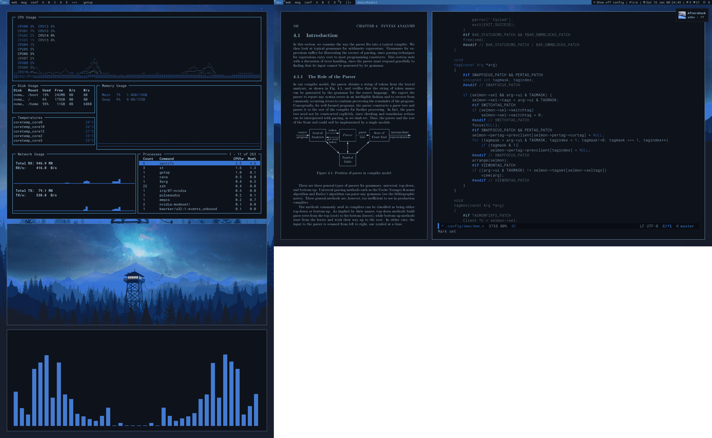

# .config

## Contents
- WM: [dwm](https://dwm.suckless.org/)
- Shell: [zsh](https://ohmyz.sh/)
- Terminal: [kitty](https://sw.kovidgoyal.net/kitty/)
- Editor: [emacs](https://www.gnu.org/software/emacs/)
- Launcher: [dmenu](https://tools.suckless.org/dmenu/)
- Status bar: [slstatus](https://tools.suckless.org/slstatus/)
- Lock screen: [slock](https://tools.suckless.org/slock/)
- PDF viewer: [zathura](https://pwmt.org/projects/zathura/)
- Notifications: [dunst](https://github.com/dunst-project/dunst)
- Keybinds: [xmodmap](https://wiki.archlinux.org/index.php/xmodmap), [xbindkeys](https://wiki.archlinux.org/index.php/Xbindkeys), [xcape](https://github.com/alols/xcape)

## Keyboard Modification
Based off of [this blog post](https://stevelosh.com/blog/2012/10/a-modern-space-cadet). 

- Tap CapsLock -> Escape
- Hold CapsLock -> Control
- Tap Shift_L -> (
- Tap Shift_R -> )
- Control key -> Hyper

## Pywal

Custom pywal templates and a custom dwm patch allow for changing essentially everything's colors with pywal. [ewal](https://gitlab.com/jjzmajic/ewal) works great for Emacs.

## dmenu scripts
TODO: coming soon
